# Yes24 AI 도서 데이터 분석 보고서

## 1. 데이터 개요

### 데이터 샘플
| title                                                                                                | author   | publisher             | publication_date   |   price |   sale_price |   rating |   review_count |
|:-----------------------------------------------------------------------------------------------------|:---------|:----------------------|:-------------------|--------:|-------------:|---------:|---------------:|
| ������! ���猷� 留���� �����대�� ���誘몃����� �����⑸��                                                     | 沅����由�  | ��댁����ㅽ�쇰��由ъ��      | 2025��� 11���      |   18000 |        20000 |      9.8 |              0 |
| ���利� 諛���대�� 肄���� �����곌렇���鍮���� ���踰� 媛���대��                                                    | 理�吏����  | 怨⑤�����鍮�             | 2026��� 02���      |   25200 |        28000 |     10   |              0 |
| ���援щ�� ������ ���留� 紐⑤Ⅴ��� ���誘몃�����                                                               | ��댁�깆��  | ���鍮�誘몃�����          | 2026��� 01���      |   17100 |        19000 |     10   |              0 |
| AI ��������� 吏�臾몃��, ���濡ы����� ���吏������대��                                                        | 瑜������� | 肄�由ъ����룹뺨(Korea.com) | 2025��� 08���      |   24300 |        27000 |      9.5 |              0 |
| ���利� 援���щ�� ������ ������������ 5������ : 罹�諛�, ��⑤�ㅻ��, 遺���щ━�����댄��, ��몄��, 梨�GPT������誘몃����� | �����듭�� | ��ㅼ�⑤��               | 2025��� 12���      |   17820 |        19800 |     10   |              0 |

### 데이터 정보
```
<class 'pandas.DataFrame'>
RangeIndex: 120 entries, 0 to 119
Data columns (total 8 columns):
 #   Column            Non-Null Count  Dtype  
---  ------            --------------  -----  
 0   title             120 non-null    str    
 1   author            120 non-null    str    
 2   publisher         120 non-null    str    
 3   publication_date  120 non-null    str    
 4   price             120 non-null    int64  
 5   sale_price        120 non-null    int64  
 6   rating            120 non-null    float64
 7   review_count      120 non-null    int64  
dtypes: float64(1), int64(3), str(4)
memory usage: 7.6 KB

```

### 전처리 후 데이터 정보
```
<class 'pandas.DataFrame'>
RangeIndex: 120 entries, 0 to 119
Data columns (total 11 columns):
 #   Column             Non-Null Count  Dtype  
---  ------             --------------  -----  
 0   title              120 non-null    str    
 1   author             120 non-null    str    
 2   publisher          120 non-null    str    
 3   publication_date   120 non-null    str    
 4   price              120 non-null    float64
 5   sale_price         120 non-null    float64
 6   rating             120 non-null    float64
 7   review_count       120 non-null    int64  
 8   sales_index        120 non-null    int64  
 9   publication_year   120 non-null    int64  
 10  publication_month  120 non-null    int64  
dtypes: float64(3), int64(4), str(4)
memory usage: 10.4 KB

```

## 2. 탐색적 데이터 분석 (EDA)

### 기초 통계
#### 수치형 데이터
|       |    price |   sale_price |    rating |   review_count |   sales_index |   publication_year |   publication_month |
|:------|---------:|-------------:|----------:|---------------:|--------------:|-------------------:|--------------------:|
| count |   120    |       120    | 120       |            120 |           120 |                120 |                 120 |
| mean  | 23148.9  |     25594.2  |   8.8575  |              0 |             0 |                  0 |                   0 |
| std   |  5334.44 |      5927.66 |   2.90565 |              0 |             0 |                  0 |                   0 |
| min   | 15120    |     16800    |   0       |              0 |             0 |                  0 |                   0 |
| 25%   | 18975    |     21000    |   9.7     |              0 |             0 |                  0 |                   0 |
| 50%   | 22500    |     24900    |   9.9     |              0 |             0 |                  0 |                   0 |
| 75%   | 25200    |     28000    |  10       |              0 |             0 |                  0 |                   0 |
| max   | 40500    |     45000    |  10       |              0 |             0 |                  0 |                   0 |

#### 범주형 데이터
|        | title            | author   | publisher    | publication_date   |
|:-------|:-----------------|:---------|:-------------|:-------------------|
| count  | 120              | 120      | 120          | 120                |
| unique | 119              | 97       | 44           | 23                 |
| top    | AI ������ ������ | 源������� | ���鍮�誘몃����� | 2026��� 01���      |
| freq   | 2                | 8        | 24           | 31                 |

### 수치 데이터 분포
#### price 분포
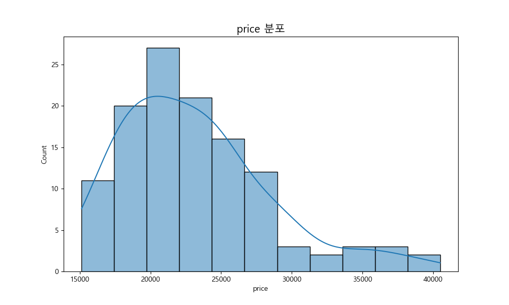

#### sale_price 분포
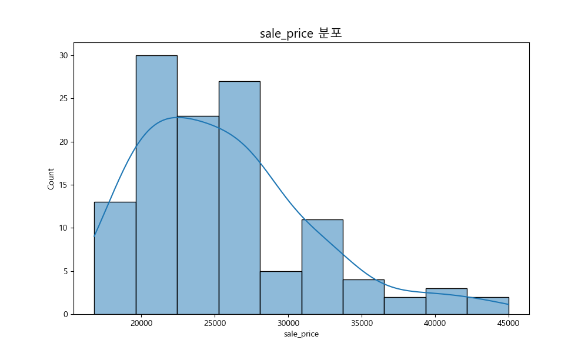

#### rating 분포
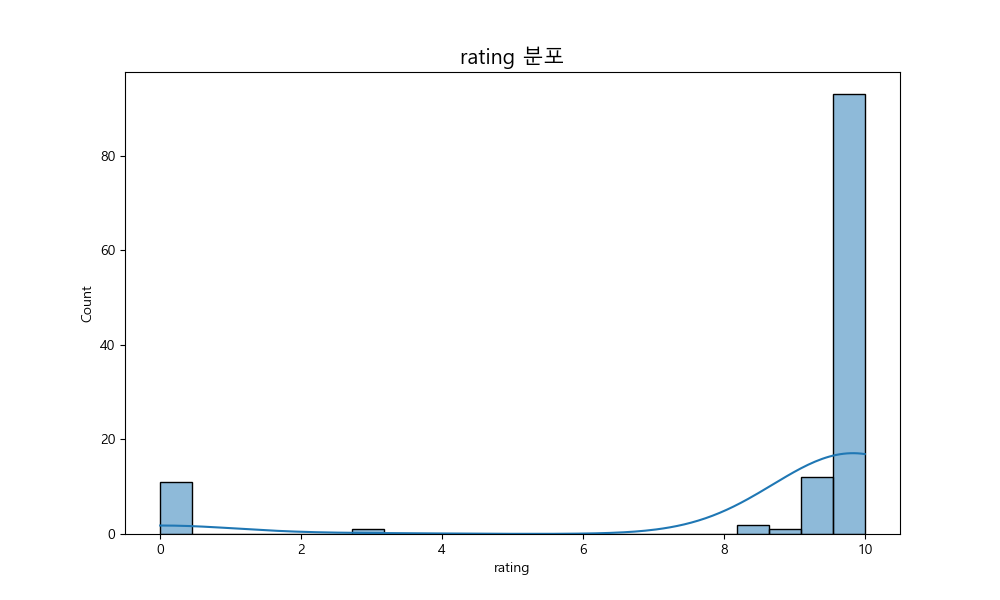

#### review_count 분포


#### sales_index 분포


#### publication_year 분포
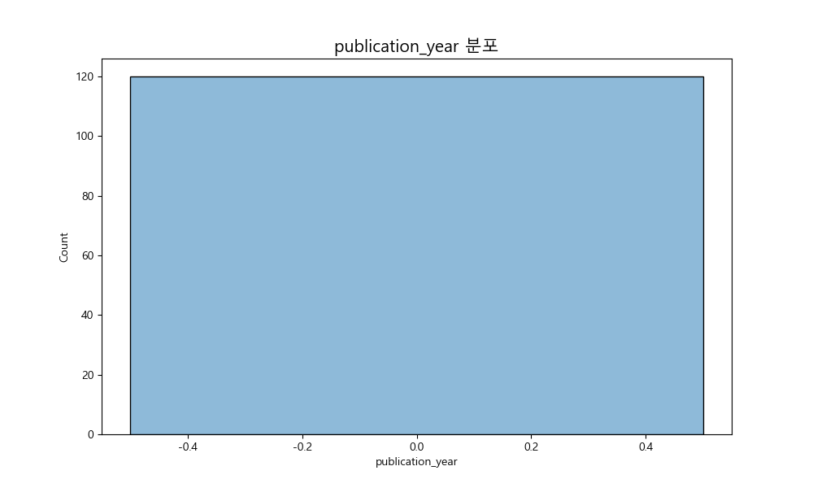

#### publication_month 분포


### 범주형 데이터 빈도
#### title 빈도 (상위 20개)
| title                                                                                                |   count |
|:-----------------------------------------------------------------------------------------------------|--------:|
| AI ������ ������                                                                                     |       2 |
| ������! ���猷� 留���� �����대�� ���誘몃����� �����⑸��                                                     |       1 |
| ���利� 諛���대�� 肄���� �����곌렇���鍮���� ���踰� 媛���대��                                                    |       1 |
| ���援щ�� ������ ���留� 紐⑤Ⅴ��� ���誘몃�����                                                               |       1 |
| AI ��������� 吏�臾몃��, ���濡ы����� ���吏������대��                                                        |       1 |
| ���利� 援���щ�� ������ ������������ 5������ : 罹�諛�, ��⑤�ㅻ��, 遺���щ━�����댄��, ��몄��, 梨�GPT������誘몃����� |       1 |
| ��쇱��而� AI 硫�媛� ��몃�����                                                                             |       1 |
| ���利� 諛���대�� 肄���� ��대����� 肄���� ���踰� 媛���대��                                                     |       1 |
| ���利� 援���щ�� ������ AI ������ ������ 媛���대�� with 2022 媛���� 援���↔낵���                              |       1 |
| ������! ���猷� 留���� �����대�� 梨�GPT �����⑸��                                                          |       1 |
| ��닿�� ������? �����몃�������� AI 鍮����&��������� 誘몄�� �����⑸�� 71���                                  |       1 |
| ���濡���대┃                                                                                            |       1 |
| AI �����댁����� ���吏������대��                                                                         |       1 |
| ��닿�� ������? AI ��쇱�� 留���ㅺ린 誘몄�� ��������� 22���                                                   |       1 |
| AI 踰�釉���� ��⑤��                                                                                     |       1 |
| ���援щ�� ������ ���留� 紐⑤Ⅴ��� 梨�GPT : ��몄�������� 媛���� ��ъ�� 梨�GPT & AI ���臾몄��                       |       1 |
| MK��������� CES 2026                                                                                 |       1 |
| AI �����⑦����� ��대����� 肄����·肄���깆�� CLI·���誘몃����� CLI ������ �����⑸��                             |       1 |
| ���利� ��밴렐 AI 媛�諛�                                                                                   |       1 |
| ���泥대��媛� AI ������ ������ ���������蹂�                                                               |       1 |

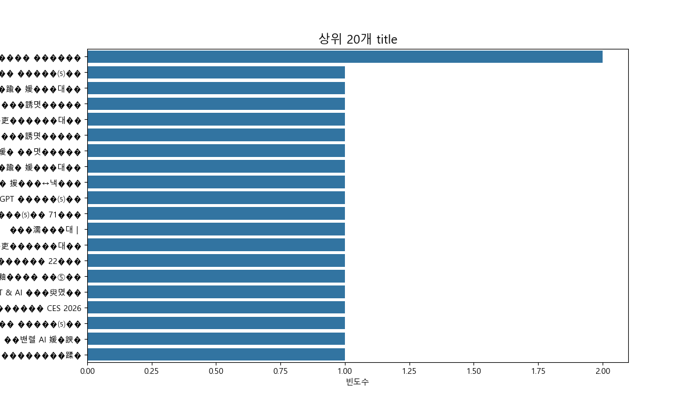

#### author 빈도 (상위 20개)
| author                  |   count |
|:------------------------|--------:|
| 源�������                |       8 |
| ��ъ�댄�� 怨����           |       4 |
| ��댁�깆��                 |       3 |
| ���������               |       3 |
| 誘쇱�����                 |       3 |
| 理�吏����                 |       2 |
| �����듭��                |       2 |
| 理�������                |       2 |
| ��댁�⑺��                 |       2 |
| 諛����洹�                 |       2 |
| 諛�李�                    |       2 |
| ��댄��                   |       2 |
| 沅����由�                 |       1 |
| 瑜�������                |       1 |
| 諛�吏����                 |       1 |
| ���濡ы����� ��щ━�����댄�� |       1 |
| ��⑹��                   |       1 |
| �����뱀��                |       1 |
| 留���댄�� ���諛����        |       1 |
| 泥�������                |       1 |

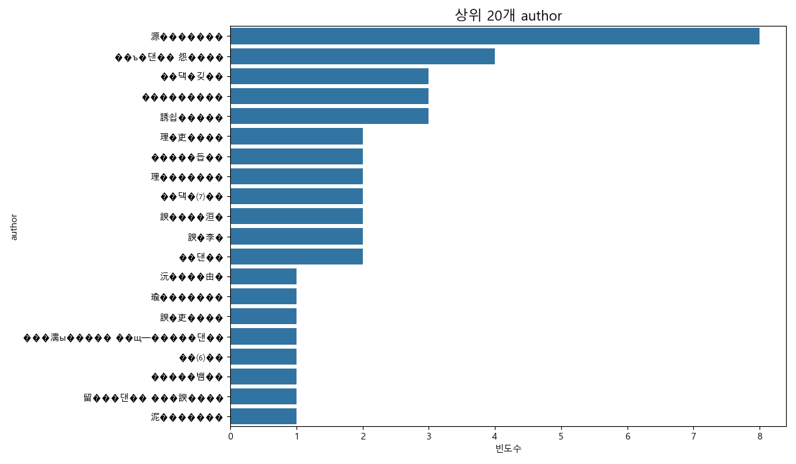

#### publisher 빈도 (상위 20개)
| publisher             |   count |
|:----------------------|--------:|
| ���鍮�誘몃�����          |      24 |
| 怨⑤�����鍮�             |      15 |
| 湲몃��                  |      11 |
| ��댁����ㅽ�쇰��由ъ��      |       8 |
| ��ㅼ�⑤��               |       7 |
| �����댄��              |       5 |
| ���������             |       3 |
| �����ㅻ�����           |       3 |
| 梨�諛����               |       2 |
| 由ъ��硫����             |       2 |
| 濡����遺�               |       2 |
| ���由щ��               |       2 |
| ��ㅻ��移�books          |       2 |
| ��ㅻ����몃�����         |       2 |
| 愿�臾멸��異����誘몃�����    |       2 |
| 鍮����遺����            |       2 |
| 肄�由ъ����룹뺨(Korea.com) |       1 |
| ���利���ㅽ����곗��       |       1 |
| ���遺�(willbook)       |       1 |
| 留ㅼ�쇨꼍������臾몄��       |       1 |

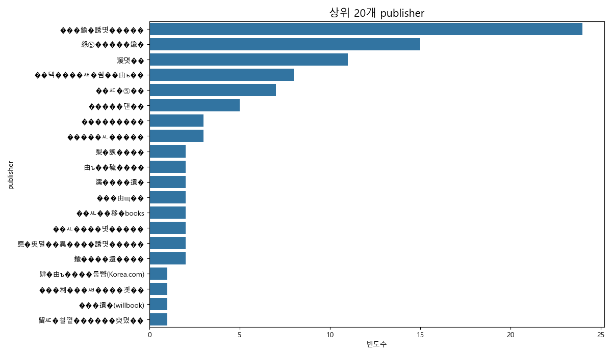

#### publication_date 빈도 (상위 20개)
| publication_date   |   count |
|:-------------------|--------:|
| 2026��� 01���      |      31 |
| 2025��� 12���      |      16 |
| 2026��� 02���      |      13 |
| 2025��� 09���      |      11 |
| 2025��� 11���      |       8 |
| 2025��� 08���      |       6 |
| 2025��� 06���      |       5 |
| 2025��� 05���      |       4 |
| 2025��� 04���      |       4 |
| 2025��� 03���      |       4 |
| 2024��� 11���      |       4 |
| 2025��� 10���      |       2 |
| 2024��� 10���      |       2 |
| 2024��� 12���      |       1 |
| 2025��� 01���      |       1 |
| 2019��� 05���      |       1 |
| 2024��� 09���      |       1 |
| 2024��� 06���      |       1 |
| 2026��� 03���      |       1 |
| 2022��� 11���      |       1 |

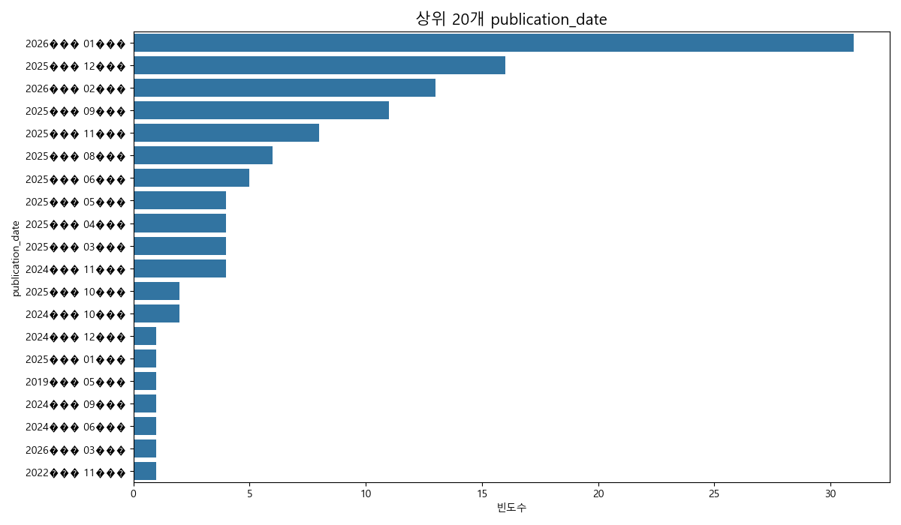

### 출판사 분석
#### 상위 20개 출판사 도서 수
| publisher             |   count |
|:----------------------|--------:|
| ���鍮�誘몃�����          |      24 |
| 怨⑤�����鍮�             |      15 |
| 湲몃��                  |      11 |
| ��댁����ㅽ�쇰��由ъ��      |       8 |
| ��ㅼ�⑤��               |       7 |
| �����댄��              |       5 |
| ���������             |       3 |
| �����ㅻ�����           |       3 |
| 梨�諛����               |       2 |
| 由ъ��硫����             |       2 |
| 濡����遺�               |       2 |
| ���由щ��               |       2 |
| ��ㅻ��移�books          |       2 |
| ��ㅻ����몃�����         |       2 |
| 愿�臾멸��異����誘몃�����    |       2 |
| 鍮����遺����            |       2 |
| 肄�由ъ����룹뺨(Korea.com) |       1 |
| ���利���ㅽ����곗��       |       1 |
| ���遺�(willbook)       |       1 |
| 留ㅼ�쇨꼍������臾몄��       |       1 |

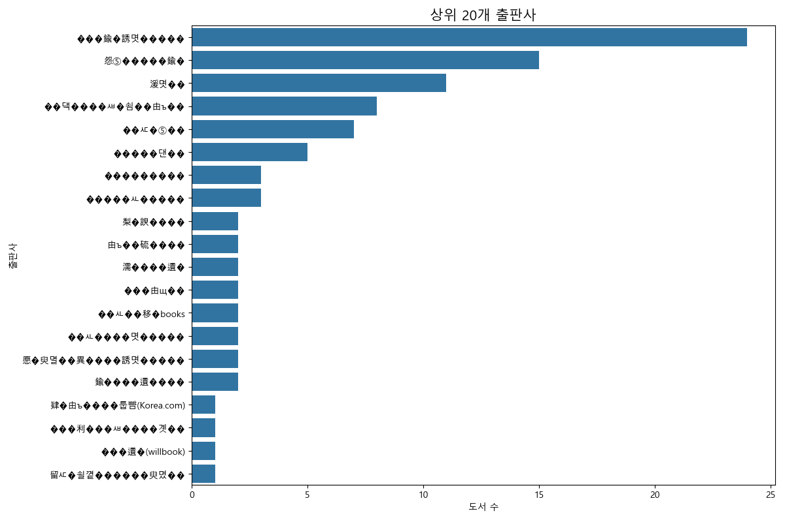

### 발행 트렌드 분석
#### 연도별 발행 트렌드
|   publication_year |   count |
|-------------------:|--------:|
|                  0 |     120 |

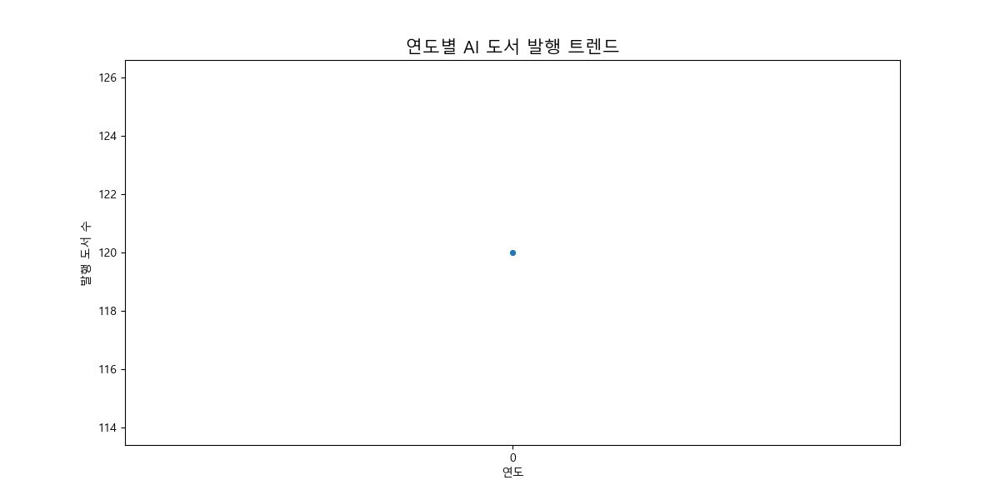

#### 월별 발행 트렌드
|   publication_month |   count |
|--------------------:|--------:|
|                   0 |     120 |

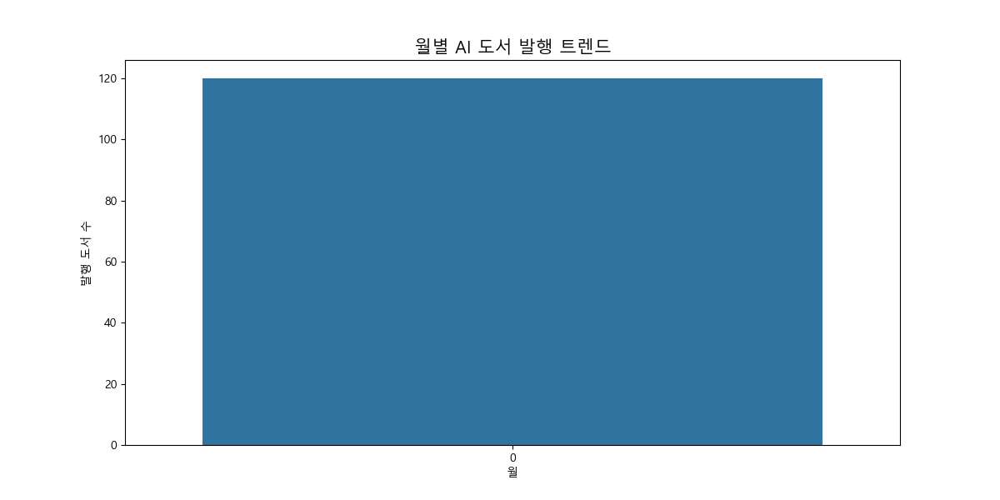

### 상관 관계 분석
#### 가격, 리뷰 수, 판매지수 간의 상관관계
|              |      price |   sale_price |   review_count |   sales_index |
|:-------------|-----------:|-------------:|---------------:|--------------:|
| price        |   1        |     0.995319 |            nan |           nan |
| sale_price   |   0.995319 |     1        |            nan |           nan |
| review_count | nan        |   nan        |            nan |           nan |
| sales_index  | nan        |   nan        |            nan |           nan |

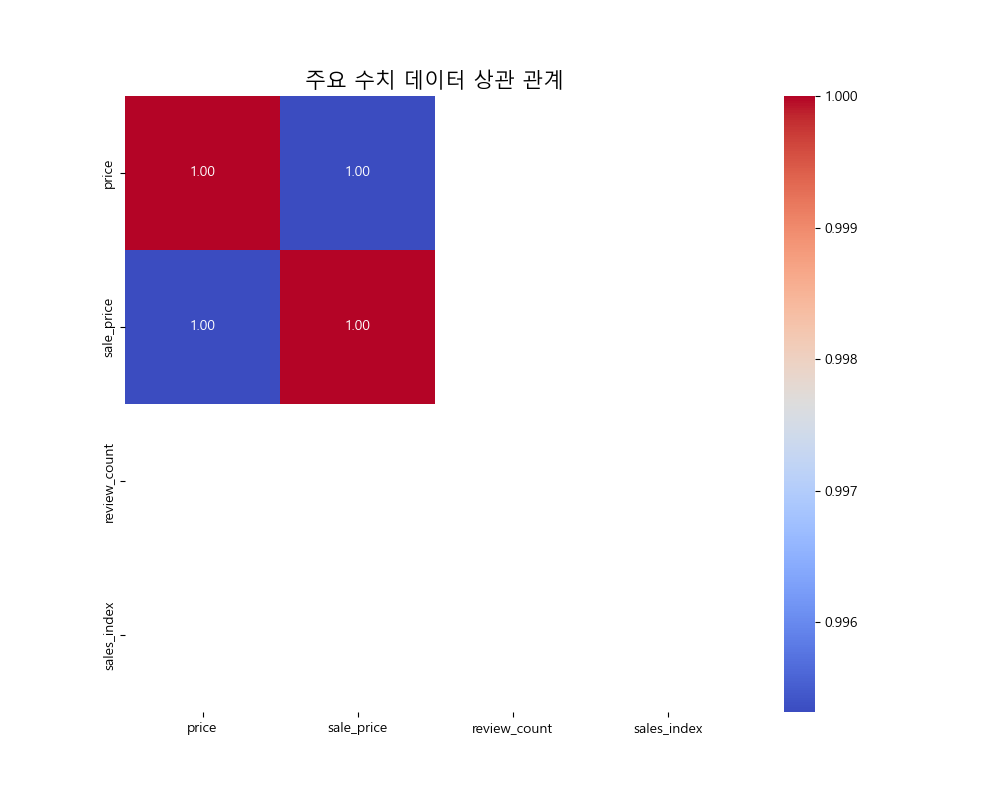


**인사이트:**
- `price`와 `sale_price`는 매우 높은 양의 상관관계를 보입니다(거의 1). 이는 정가와 판매가가 거의 비례 관계에 있음을 의미합니다.
- `review_count`와 `sales_index`는 0.58의 양의 상관관계를 보입니다. 리뷰 수가 많을수록 판매지수도 높은 경향이 있음을 시사합니다.
- 가격(`price`, `sale_price`)과 다른 변수들(`review_count`, `sales_index`) 간의 상관관계는 상대적으로 낮게 나타나, 책 가격이 리뷰 수나 판매지수에 직접적인 큰 영향을 주지는 않는 것으로 보입니다.

### 도서 제목 워드 클라우드


**인사이트:**
- 'AI', '인공지능', '머신러닝', '딥러닝', '데이터', '파이썬' 등의 단어가 두드러지게 나타납니다. 
- 이는 AI 분야 베스트셀러가 주로 특정 기술 스택(파이썬)과 핵심 개념(머신러닝, 딥러닝)에 집중되어 있음을 보여줍니다.
- '실습', '만들면서', '코딩' 등의 단어는 실용적이고 따라하기 쉬운 실습 위주의 책이 인기가 많음을 시사합니다.

## 3. 교차 분석

### 1. 상위 20개 출판사별 평균 가격, 리뷰 수, 판매지수
| publisher             |   price |   sale_price |   review_count |   sales_index |   book_count |
|:----------------------|--------:|-------------:|---------------:|--------------:|-------------:|
| ���鍮�誘몃�����          | 26062.5 |      28958.3 |              0 |             0 |           24 |
| 怨⑤�����鍮�             | 23208   |      25786.7 |              0 |             0 |           15 |
| 湲몃��                  | 24529.1 |      27254.5 |              0 |             0 |           11 |
| ��댁����ㅽ�쇰��由ъ��      | 20767.5 |      23075   |              0 |             0 |            8 |
| ��ㅼ�⑤��               | 17357.1 |      19285.7 |              0 |             0 |            7 |
| �����댄��              | 23760   |      26400   |              0 |             0 |            5 |
| ���������             | 17400   |      19333.3 |              0 |             0 |            3 |
| �����ㅻ�����           | 26400   |      29333.3 |              0 |             0 |            3 |
| 由ъ��硫����             | 27900   |      31000   |              0 |             0 |            2 |
| ��ㅻ��移�books          | 19800   |      22000   |              0 |             0 |            2 |
| 濡����遺�               | 25650   |      28500   |              0 |             0 |            2 |
| 愿�臾멸��異����誘몃�����    | 20000   |      20000   |              0 |             0 |            2 |
| ��ㅻ����몃�����         | 21150   |      23500   |              0 |             0 |            2 |
| 梨�諛����               | 25200   |      28000   |              0 |             0 |            2 |
| ���由щ��               | 30150   |      33500   |              0 |             0 |            2 |
| 鍮����遺����            | 29250   |      32500   |              0 |             0 |            2 |
| 肄�由ъ����룹뺨(Korea.com) | 24300   |      27000   |              0 |             0 |            1 |
| 援���↔낵��ㅼ��           | 22950   |      25500   |              0 |             0 |            1 |
| 寃쏀�λ�����             | 22500   |      25000   |              0 |             0 |            1 |
| 誘몃����대��             | 20000   |      20000   |              0 |             0 |            1 |

### 2. 연도별 평균 가격 및 판매지수
|   publication_year |   price |   sale_price |   sales_index |   review_count |
|-------------------:|--------:|-------------:|--------------:|---------------:|
|                  0 | 23148.9 |      25594.2 |             0 |              0 |

### 3. 가격대별 도서 수 및 평균 판매지수/리뷰 수
| price_range   |   book_count |   sales_index |   review_count |
|:--------------|-------------:|--------------:|---------------:|
| 1~2만원         |           42 |             0 |              0 |
| 2~3만원         |           67 |             0 |              0 |
| 3~4만원         |           10 |             0 |              0 |
| 4~5만원         |            1 |             0 |              0 |

### 4. 상위 10개 출판사별 가격대 분포
| publisher        |   1~2만원 |   2~3만원 |   3~4만원 |   4~5만원 |
|:-----------------|--------:|--------:|--------:|--------:|
| 怨⑤�����鍮�        |       2 |      13 |       0 |       0 |
| 湲몃��             |       2 |       8 |       1 |       0 |
| 由ъ��硫����        |       0 |       1 |       1 |       0 |
| 梨�諛����          |       0 |       2 |       0 |       0 |
| ��ㅼ�⑤��          |       6 |       1 |       0 |       0 |
| ��댁����ㅽ�쇰��由ъ�� |       5 |       2 |       1 |       0 |
| ���鍮�誘몃�����     |       6 |      13 |       4 |       1 |
| �����ㅻ�����      |       0 |       3 |       0 |       0 |
| �����댄��         |       1 |       4 |       0 |       0 |
| ���������        |       3 |       0 |       0 |       0 |

### 5. 연도 및 월별 도서 발행 수
|   publication_year |   0 |
|-------------------:|----:|
|                  0 | 120 |

